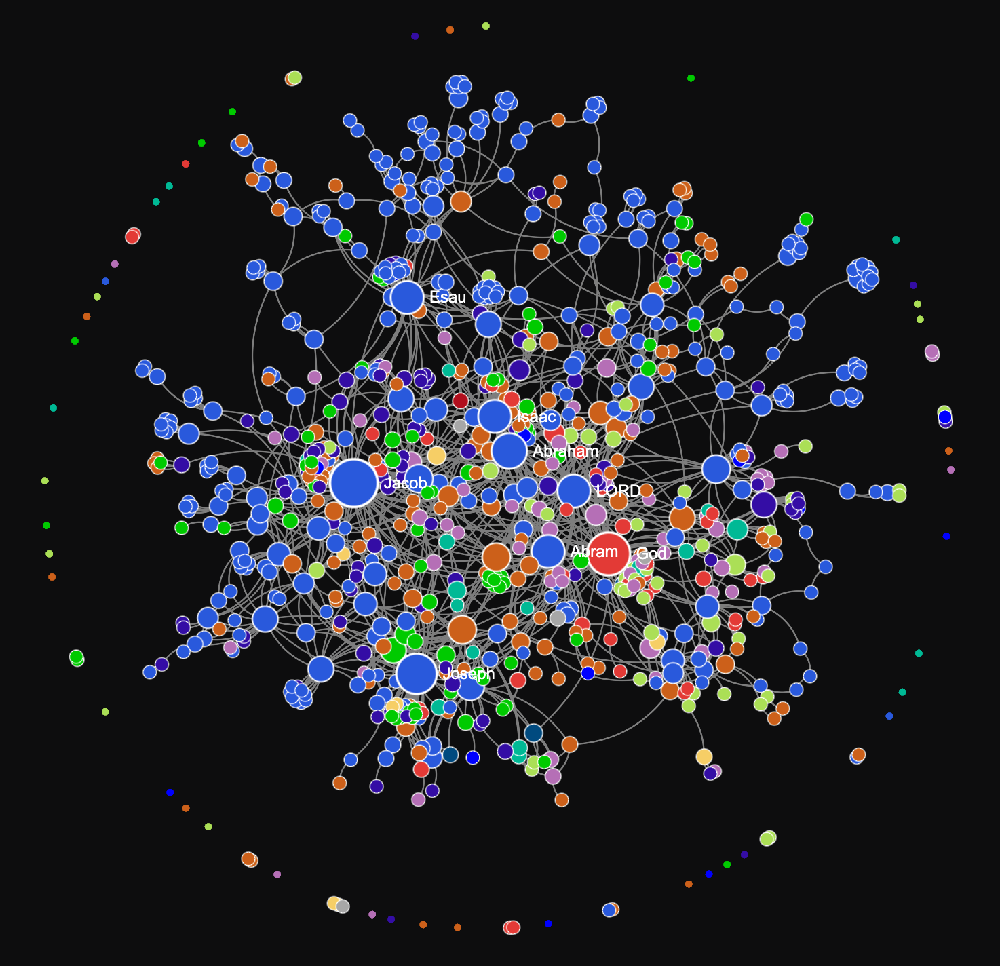

# Genesis — LightRAG Knowledge Graph & Evaluation

A knowledge graph retrieval-augmented generation (RAG) system built over the biblical Book of Genesis using **LightRAG**, evaluated against a 585-question benchmark spanning multiple difficulty tiers.

---

## 📖 Source Text

The knowledge base was constructed from the text of:
- **Title:** *The Bible, King James Version, Book 1: Genesis*
- **Source:** [Project Gutenberg eBook #8001](https://www.gutenberg.org/cache/epub/8001/pg8001.txt)
- **Format:** Full plain-text transcription of chapters 1 through 50

---

## 🕸️ Knowledge Graph Visualization

*Figure 1: Full entity and relation knowledge graph extracted from Genesis using LightRAG.*

---

## 📊 Evaluation & Benchmark Results

The system was evaluated against 585 multiple-choice questions categorized by difficulty using `query_lightrag.py` in hybrid retrieval mode.

> [!NOTE]
> **Disclaimer:** The benchmark was evaluated on **585 / 692** total questions. The final ~100 questions (indices 586–692) were excluded from this run as they ran into API rate/token limits.

### Overall Performance

| Metric | Value |
| :--- | :--- |
| **Source File** | `testing/grade/grade_adjusted.json` / `scored.json` |
| **Total Evaluated** | **585 / 692 questions** |
| **Correct Answers** | **577** (98.63%) |
| **Incorrect Answers** | **7** (1.20%) |
| **Uncertain / No Context (`-1`)** | **1** (0.17%) |
| **Attempted Accuracy (1 vs. 0)** | **98.80%** (577 / 584) |
| **Overall Accuracy** | **98.63%** (577 / 585) |

### Accuracy by Difficulty Tier

| Difficulty | Total Questions | Correct | Incorrect | Uncertain | Accuracy (Overall) | Accuracy (Attempted) |
| :--- | :---: | :---: | :---: | :---: | :---: | :---: |
| **Beginner** | 169 | 168 | 1 | 0 | **99.41%** | **99.41%** |
| **Intermediate** | 267 | 261 | 5 | 1 | **97.75%** | **98.12%** |
| **Advanced** | 149 | 148 | 1 | 0 | **99.33%** | **99.33%** |
| **Total** | **585** | **577** | **7** | **1** | **98.63%** | **98.80%** |

### Latency & Token Usage

| Metric | Total | Average / Question |
| :--- | :--- | :--- |
| **Execution Time** | 3,478.37 s (~57.97 min) | 5.95 s |
| **Prompt Tokens** | 109,399 tokens | 187.01 tokens |
| **Completion Tokens** | 594 tokens | 1.02 tokens |
| **Total Tokens** | 109,993 tokens | 188.02 tokens |

---